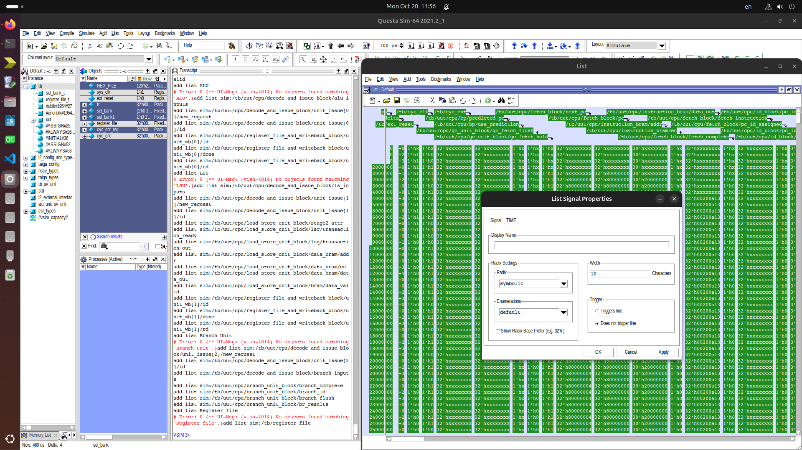

# trace-riscv-excel-gen
Скрипт для генерации трассы выполнения программы на микропроцессорном ядре Taiga для [ЛР1 Изучение принципов работы микропроцессорного ядра RISC-V](https://gitlab.com/sibragimov/riscv-lab/-/blob/main/main.adoc) 

## Вдохновился
[оригинал](https://github.com/dakone22/riscv-lab-pipeline-generator/tree/master)

У меня лично скрипт выше выдавал пустой результат, поэтому решил его дописать. Если с моим не получится, попробуйте его.

## Использование

### Получение входных данных

1. Запустить симуляцию в среде Modelsim (см. методичку по лабораторной работе)
2. Экспортировать данные симуляции:
   1. Активировать окно `List`: вкладка `View` -> `List`
      
   2. Выделить все сигналы (`Ctrl+A`) на Wave-диаграмме и скопировать (`Ctrl+C`)
   3. Перейти на вкладку `List` и вставить все сигналы (`Ctrl+V`) и у него выбрать `View` -> `Signal Properties` и проверить, что настройки формата соответствуют картинке  
   4. Экспортировать: `File` -> `Export` -> `Tabular list...` и сохранить в виде файла формата `.lst` (обязательно этот формат!)
      

### Результаты в формате CSV и Excel

- По умолчанию запуск `generator.py inputFile.lst [outputFile.csv]`

- Для генерации сразу в Эксель `generator.py inputFile.lst [outputFile.xlsx] --export`

- Есть еще флаг `--verbose` для вывода подробной информации.

- Если не указать `outputFile`, результат будет сохранен в файле с названием входного файла.

**Результат:**

### При участии

- [@val3rkq](https://github.com/val3rkq)
- [@KalimBaTony](https://github.com/KalimBaTony)
